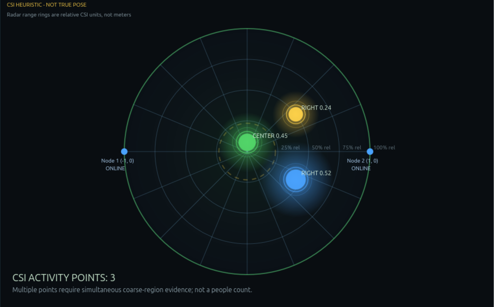

# WaveSense 🎯


## Basic Details
### Team Name: WaveSense


### Team Members
- Team Lead: Aaron Kurian Abraham - Govt. Model Engineering College
- Member 2: Elizabeth Bobby - Govt. Model Engineering College

### Project Description
WaveSense is a camera-free Wi-Fi CSI sensing experiment that uses ESP32-S3 nodes and a laptop dashboard to detect motion and presence from real Wi-Fi signal changes.
It turns boring phone hotspot packets into a live radar-style activity view without cameras, microphones, or trained ML models.

### The Problem (that doesn't exist)
People already walk around perfectly well, but apparently walls, rooms, and Wi-Fi signals were feeling left out of the drama.
So we decided to ask the Wi-Fi: "Did someone move?" and make it answer with signal wiggles.

### The Solution (that nobody asked for)
Two ESP32-S3 boards listen to CSI from a phone hotspot link, send compact UDP packets to a laptop, and a Python dashboard converts the signal changes into live motion and presence indicators.
No fake camera pose, no random animation, just real CSI-derived activity hypotheses.

## Technical Details
### Technologies/Components Used
For Software:
- Python 3
- ESP-IDF firmware for ESP32-S3
- UDP socket receiver
- HTML Canvas dashboard
- Pytest
- Docker ESP-IDF build environment

For Hardware:
- 2x Seeed Studio XIAO ESP32-S3 boards
- 8 MB flash, 8 MB PSRAM
- External antennas
- Linux Mint laptop
- Mobile phone hotspot
- USB cables for flashing/debug logs

### Implementation
For Software:
# Installation
```bash
git clone git@github.com:AaronKurian/WaveSense.git
cd WaveSense
python3 -m pytest tests -q
```

# Run
```bash
python3 visualization/dashboard.py \
  --udp-bind 0.0.0.0 \
  --udp-port 5005 \
  --http-bind 127.0.0.1 \
  --http-port 8088
```

Open:

```text
http://127.0.0.1:8088/
```

For detailed firmware, packet format, calibration, and processing notes, see:

```text
TECHNICAL_README.md
docs/packet-format.md
```

### Project Documentation
For Software:

# Screenshots

*Live WaveSense dashboard screenshot showing the CSI sensing interface.*

# Diagrams
```text
Phone hotspot
  |-- ESP32-S3 Node 1
  |-- ESP32-S3 Node 2
          |
          +-- UDP CSI packets --> Laptop receiver
                                --> CSI parser
                                --> Signal processing
                                --> Radar dashboard
```
*WaveSense receives real Wi-Fi CSI packets from ESP32-S3 nodes and visualizes signal-derived activity.*

For Hardware:

# Schematic & Circuit
```text
Phone hotspot )))  ESP32-S3 Node 1  --USB only for power/debug
              )))  ESP32-S3 Node 2  --USB only for power/debug

Laptop on same hotspot LAN:
UDP receiver listens on 0.0.0.0:5005
Dashboard runs at http://127.0.0.1:8088/
```
*The ESP32 nodes connect over Wi-Fi to the same phone hotspot as the laptop and send CSI packets over UDP.*

```text
[Phone Hotspot / AP]
        |
        | 2.4 GHz Wi-Fi frames
        |
   +----+----+
   |         |
[Node 1]  [Node 2]
   |         |
   +---- UDP CSI ----> [Laptop Receiver + Dashboard]
```
*High-level sensing schematic for the two-node CSI setup.*

# Build Photos

*Available project image. Hardware build photos are not added yet.*


*Available project image. ESP32 flashing/debug build photos are not added yet.*


*Available project image. Final installation photo is not added yet.*

### Project Demo
# Video
No video recorded yet.
*The live demo runs locally through the WaveSense dashboard using real ESP32 CSI packets.*

# Additional Demos
- Live dashboard: `python3 visualization/dashboard.py --udp-bind 0.0.0.0 --udp-port 5005 --http-port 8088`
- Tests: `python3 -m pytest tests -q`
- Technical documentation: `TECHNICAL_README.md`

## Team Contributions
- Aaron Kurian Abraham: ESP32-S3 setup, firmware validation, CSI receiver flow, dashboard testing
- Elizabeth Bobby: Processing pipeline, radar visualization, documentation, test coverage

---
Made with ❤️ at TinkerHub Useless Projects 


